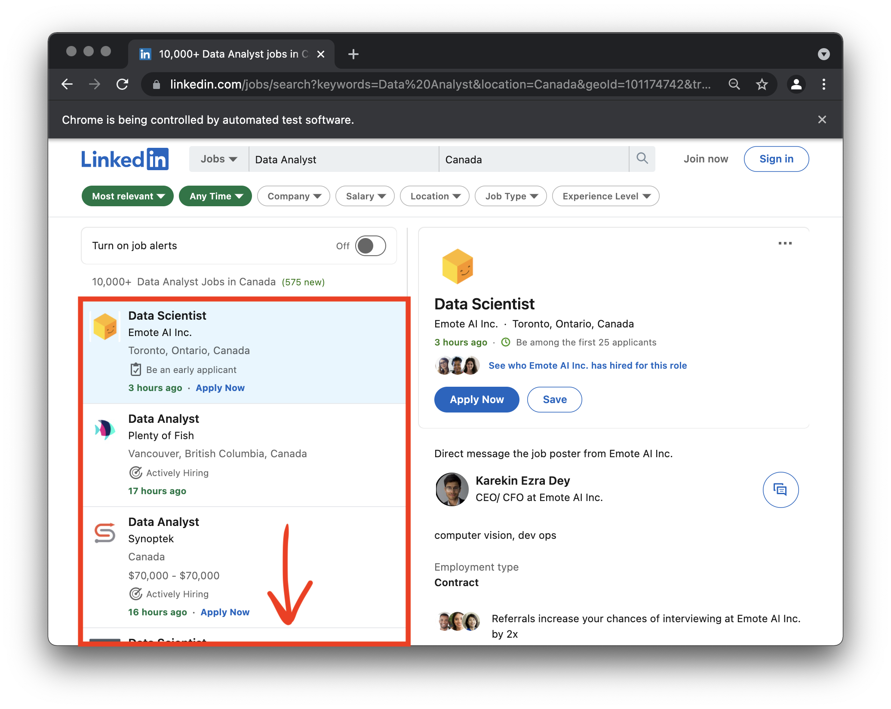

# Linkedin-jobs-sentiment-visualization-scraping-Python
This Python script scrapes up to 100 most recent Linkedin job postings of any job title and creates sentiment visualization in a form of a word cloud.

# 
# 
